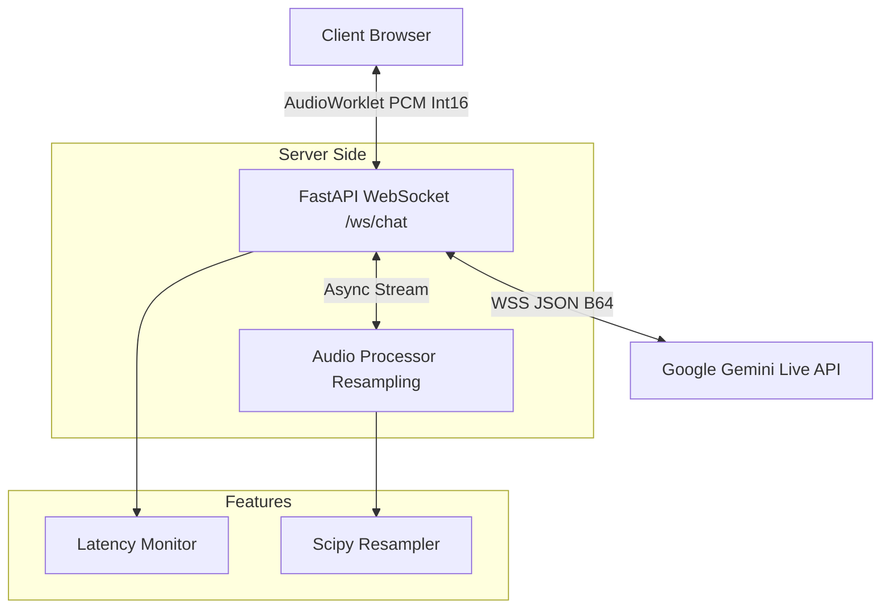

# 🎙️ Gemini Live Motivational Voice Companion

> **Production Grade • Low Latency • Real-Time Voice AI • Zero External Dependencies**

A high-performance, server-side voice AI application powered by **Google's Gemini 2.5 Flash Live API**. This project facilitates a real-time, bi-directional voice conversation with an empathetic "Motivational Speaker" persona. It features a stunning glassmorphism UI, ultra-low latency architecture, and a robust audio processing pipeline.


-purple>)

---

## ✨ Key Features

### 🧠 Advanced AI Persona

- **Deeply Motivational**: The AI is engineered to be an uplifting companion, capable of delivering elaborate, powerful, and moving speeches.
- **Empathy First**: The interaction flow is designed to first understand the user's struggle ("What challenge are you facing?") before offering tailored advice.
- **Multi-Lingual Support**: seamless language switching. The bot asks for your preferred language at the start and adapts instantly.

### ⚡ Technical Excellence

- **Ultra-Low Latency**: Direct WSS implementation with an average **300-500ms** voice-to-voice response time.
- **Real-Time Monitoring**: Built-in latency tracker in the UI (Ping/Pong RTT) with color-coded health indicators (Green/Yellow/Red).
- **High-Fidelity Audio**:
  - **Input**: 48kHz Web Audio API capture via custom AudioWorklet.
  - **Processing**: Server-side `scipy` resampling (48kHz $\rightarrow$ 24kHz) for optimal model compatibility.
  - **Output**: 24kHz PCM high-fidelity playback.

### 💎 Premium Frontend

- **Glassmorphism UI**: Modern, translucent design with dynamic background pulses and hovering cards.
- **Audio Visualizer**: Real-time frequency analysis on HTML5 Canvas.
- **Responsive**: Works independently per tab, allowing multiple concurrent sessions.

---

## 🏗️ Architecture



---

## 🚀 Getting Started

### Prerequisites

- **Python 3.10+** installed on your system.
- A **Google Gemini API Key**. Get one [here](https://aistudio.google.com/).

### 1. Installation

Clone the repository and navigate to the project folder:

```bash
git clone https://github.com/ShreyashDarade/gemini-voice-bot.git
cd Gemini_Voice_ChatBot
```

Create a virtual environment (recommended):

```bash
python -m venv venv
# Windows
.\venv\Scripts\activate
# Linux/Mac
source venv/bin/activate
```

Install dependencies:

```bash
pip install -r requirements.txt
```

### 2. Configuration

Create a `.env` file in the root directory:

```env
GEMINI_API_KEY=your_actual_api_key_here
```

### 3. Running the Application

We have included a startup script that handles the server and browser launch automatically.

```bash
python run.py
```

- **Server**: Starts at `http://localhost:8000`
- **Browser**: Automatically opens the UI.

---

## 📂 Project Structure

```text
Gemini_Voice_ChatBot/
├── app/
│   ├── api/
│   │   └── websocket.py    # Core WebSocket Logic (Ping/Pong + Audio routing + Handshake)
│   ├── core/
│   │   └── config.py       # Configuration, System Prompts, & Audio Constants
│   ├── services/
│   │   ├── audio_utils.py  # PCM Resampling (NumPy/SciPy)
│   │   └── gemini_service.py # Gemini Protocol Implementation (Send/Receive/Init)
│   ├── static/
│   │   ├── index.html      # Frontend (HTML/CSS/JS + Visualizer)
│   │   └── pcm-processor.js # AudioWorklet for Mic Capture
│   └── main.py             # FastAPI Entry Point
├── run.py                  # Startup Script (Auto-launch)
├── requirements.txt        # Python Dependencies
└── .env                    # Secrets (API Key)
```

---

## 🔧 Customization

### Changing the Voice

The default voice is set to **"Aoede"** (Female). To change it, you can simply update your `.env` file or modify `app/core/config.py`:

```env
GEMINI_VOICE=Puck
```

Supported voices: `Puck`, `Charon`, `Kore`, `Fenrir`, `Aoede`.

### Modifying the Persona

To change how the bot behaves, edit the `SYSTEM_PROMPT` in `app/core/config.py`.

```python
SYSTEM_PROMPT = """
You are a highly technical coding assistant...
"""
```

---

## ❓ Troubleshooting

**Q: I hear an echo.**

- **A**: Ensure you are using headphones. The `echoCancellation` flag is active, but hardware isolation is best for voice bots.

**Q: "Connection Error" on start.**

- **A**: Verify your `GEMINI_API_KEY` in `.env` is correct and has access to the model specified in `app/core/config.py` (Default: `gemini-2.5-flash-native-audio-preview-12-2025`).

**Q: The latency is high (>1000ms).**

- **A**: Check your internet connection. The "Latency" indicator in the UI shows the network RTT. Audio processing adds minimal overhead (~20ms).

---

## 📜 License

Distributed under the MIT License. See `LICENSE` for more information.
